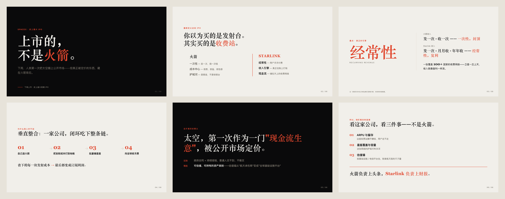

<!-- ★ LOGO（留给 Peng）：放一个字标/Logo，居中。示意：
<p align="center"></p> -->

<h1 align="center">AI PPT Forge</h1>

<p align="center"><b>一句话 · 一份资料 · 一个想法 → 能讲、能放映、能改的专业幻灯。</b></p>
<p align="center">
  一个能装进<b>任意 Agent</b>（Claude / Cursor / Codex / 自建）的开源 <b>Skill</b>——<br/>
  不是又一个 PPT 工具，而是给你的 Agent 装上一个"会做课、会汇报、会发布"的大脑。
</p>
<p align="center"><i>Turn a topic — or a document — into a designer-grade, presentable, editable slide deck. A portable Agent Skill.</i></p>

<p align="center">
  
  
  
  <a href="https://github.com/JumpX-Labs/jumpx-ppt-studio"></a>
</p>

<p align="center">
  <a href="SKILL.md"><b>30 秒上手</b></a> ·
  <a href="#它能产出什么">能产出什么</a> ·
  <a href="docs/WHY-IT-WORKS.md">为什么有效</a> ·
  <a href="docs/ARCHITECTURE.md">架构</a> ·
  <a href="https://github.com/JumpX-Labs/jumpx-ppt-studio">Web Studio</a> ·
  <a href="#来自-jumpx-实战营">训练营</a>
</p>

<!-- ★ HERO（留给 Peng）：首屏甩一张"成品长这样"——一张漂亮成品幻灯的三连图（封面+内容+数据页），
     或一段 "主题 → deck" 的 GIF。这是最高杠杆的一张图，建议宽 ~860px。示意：
<p align="center"></p> -->

---

## 为什么它不一样

市面上的 AI PPT，要么把模型塞进固定模板（版式僵、千篇一律），要么生成一堆没血肉的标题党。这个 Skill 在两件最难的事上做对了：

- 🎨 **版式由模型亲手设计，不是填模板。** 渲染时让模型按设计 token 直接写 HTML——它会**根据每页内容自己决定版面**、甚至用 CSS/SVG 画示意图与图表。达到 Stripe / Linear / Keynote 的观感，而不是"换了主题色的同一个模子"。
- 🧠 **内容有血肉，不写薄。** 每个要点都带支撑层（为什么 / 数据 / 例子）；演讲备注是 ≥150 字、可以照着念的完整口播稿；资料少时也会用机制、对比、可执行收束把单薄主题讲透。
- 🚦 **每一步都可控，不跑偏。** 严格串行管线 + 关键节点**人工门禁**（确认大纲 → 选风格 → 选输出形态），模型不会替你拍板。
- 🖼️ **双输出。** HTML 网页式（秒级、可改、可导出 PDF/PPTX/PNG）与 AI 配图式，一套内容两种产物。
- ♻️ **过程即资产。** 大纲、逐页计划、风格锁、每页图片 Prompt 全部落盘——可复现、可复用、可分享。

**结果**：交付的是一套自包含的 HTML deck——浏览器直接打开、键盘翻页、可现场演示、可导出 PDF / PPTX / 图片。换台 Agent 装上这个 Skill，效果照样复现。

---

## 30 秒上手

1. **装进你的 Agent**：把本仓库作为一个 Skill 引用 / 安装（仓库根即 skill 本体：`SKILL.md` + `references/` + `assets/` + `scripts/` + `schemas/`）。
2. **说人话触发**：
   > “帮我做一份 10 分钟的分享：重新认识睡眠，受众是训练营同学。”
   > “把这份资料做成一套课件。”（可附 PDF / 文档 / 笔记）
3. **在三个节点拍板**：确认大纲 → 选一套风格 → 选 HTML 还是 AI 配图。
4. **拿走产物**：`runs/<项目>/index.html`（可翻页 deck）+ 全套中间产物。

完整触发词、参数、流程见 [`SKILL.md`](SKILL.md)。

---

## 它能产出什么

| 产物 | 说明 |
|------|------|
| **HTML deck**（主力） | 单文件自包含、16:9、横向翻页、键盘/触摸/ESC 索引；本地直接打开 |
| **现场演示 / 导出** | 可全屏演示；可导出 PDF（矢量）/ PPTX / 逐页 PNG |
| **AI 配图 deck** | 配置图片 backend 后，逐页真实出图（Image-first） |
| **可复用资产** | `slide_plan.json`、`style_lock.json`、每页图片 `prompts/`、风格 preset |

样例（含 HTML 成品 + 全套中间产物）见 [`assets/examples/`](assets/examples/)。

### 真实案例（持续补充）

> 下面都是**用本 Skill 真实生成**的成品——非示意图、非手工美化。每个 case 走完整九步管线、`validate_html` 0 改动通过。

**Case 01 · 观点型 editorial** ——「SpaceX 史上最大 IPO，但重点不是火箭」

<p align="center"></p>
<p align="center"><sub><i><code>editorial-magazine</code> 风格 · 6 页观点弧（封面 → 反框架 → 数字锚 → 闭环 → 金句 → 收尾）· 模型按 <code>style_lock</code> 直写 HTML · <a href="assets/examples/spacex-ipo/">打开源文件 / 全套中间产物 →</a></i></sub></p>

<!-- ★ 案例库（留给 Peng / 持续补充）：以后每多一个真实成品，复制上面一个 Case 块即可——
     图放 docs/cases/<slug>.png（建议宽 ~840px，6 页合成图或三连图），配一行说明（风格 · 页数 · 看点）。 -->

---

## 工作原理速览

九步串行管线，关键处人工门禁（⛔=必须停下等你）：

```
意图澄清 → 资料吸收 → 大纲 ⛔ → 逐页计划 → 叙事审核 → 设计定稿(风格锁) ⛔
        → 渲染 ⛔(HTML 模型直接写 / AI 配图) → 质检 → 交付
```

内部是多角色协作（策略、写作、审核、设计、渲染、风格守卫、制片…），每个角色一份指令文档（`references/`）。**为什么这套能产出好结果**，见 [`docs/WHY-IT-WORKS.md`](docs/WHY-IT-WORKS.md)；**完整架构**见 [`docs/ARCHITECTURE.md`](docs/ARCHITECTURE.md)。

---

## 7 套内置视觉风格

`teaching-clean`（教学清爽，默认）· `editorial-magazine`（杂志感）· `swiss-system`（瑞士网格）· `blueprint`（蓝图）· `sketch-notes`（手绘笔记）· `corporate`（商务）· `creator-social`（创作者/社媒）

<!-- ★ 风格画廊（留给 Peng）：这是"显得大"的关键一面墙——把真·模型产出的每套风格各放一张。
     现成图就在 studio 仓库：jumpx-ppt-studio/backend/preset_previews/<style>-1.png（7 风格 × 2 张）。
     建议把它们复制进本仓库 docs/presets/ 后，用下面这张表（把注释去掉、填好图）：
| teaching-clean | editorial-magazine | swiss-system | blueprint |
|:--:|:--:|:--:|:--:|
|  |  |  |  |
| **sketch-notes** | **corporate** | **creator-social** | |
|  |  |  | |
-->

每套含语义档（`assets/style-presets/*.json`）+ 落地 CSS（`assets/styles/*.css`）。风格也可由参考图导入或自定义——视觉是设计 token，模型据此自由发挥。

---

## 目录结构

```
SKILL.md              # ★ Agent 入口：触发、管线、门禁、铁律
references/           # 各角色指令文档（00–15）+ 可改层（叙事/写作/风格…）
assets/
  style-presets/      # 7 套风格语义档（JSON）= 设计 token，渲染据此发挥
  styles/             # 7 套风格参考 CSS（视觉基准/参考）
  examples/           # 完整样例 deck
schemas/              # slide_plan / style_lock / image_prompts 的 JSON Schema
scripts/              # 校验 / 出图 / 导出（纯 stdlib，不含 LLM）
docs/                 # 给人看：架构 / 为什么有效（非 Agent 运行所需）
```

---

## 文档导航

| 你是… | 看这里 |
|--------|--------|
| **Agent / 想直接用** | [`SKILL.md`](SKILL.md) |
| 想懂它怎么搭的 | [`docs/ARCHITECTURE.md`](docs/ARCHITECTURE.md) |
| 想懂它为什么好 | [`docs/WHY-IT-WORKS.md`](docs/WHY-IT-WORKS.md) |
| 选/定风格 | [`references/12-style-presets.md`](references/12-style-presets.md) |
| 配置图片 API | [`.env.example`](.env.example)（复制为 `.env`，**勿提交密钥**） |
| 跑样例 | [`assets/examples/README.md`](assets/examples/README.md) |

---

## 来自 JumpX 实战营

这个 Skill 不是 demo，是 **JumpX AI 实战营**里"用 Agent 造真产品"的一块教学成果——配套的 Web 操作台 [`jumpx-ppt-studio`](https://github.com/JumpX-Labs/jumpx-ppt-studio) 把它跑成了一个能用的应用。

- 🧩 **想直接用** → 把本仓库当 Skill 装进你的 Agent，从 [`SKILL.md`](SKILL.md) 起手。
- 🖥️ **想要带界面的版本** → [`jumpx-ppt-studio`](https://github.com/JumpX-Labs/jumpx-ppt-studio)。
- 🎓 **想学会"怎么把一个 AI 想法做成真产品"** → 来 JumpX AI 实战营。<!-- ★ 训练营报名链接（留给 Peng）：把这句换成带链接的 CTA。 -->
- ⭐ 觉得有用就点个 Star —— 这是对开源最实在的鼓励。

---

## 许可 / 版本

见 [`SKILL.md`](SKILL.md) 顶部版本声明；发布版本以 git tag 锚定（当前稳定：[`v1.1.0`](https://github.com/JumpX-Labs/jumpx-ppt-forge/releases)）。
