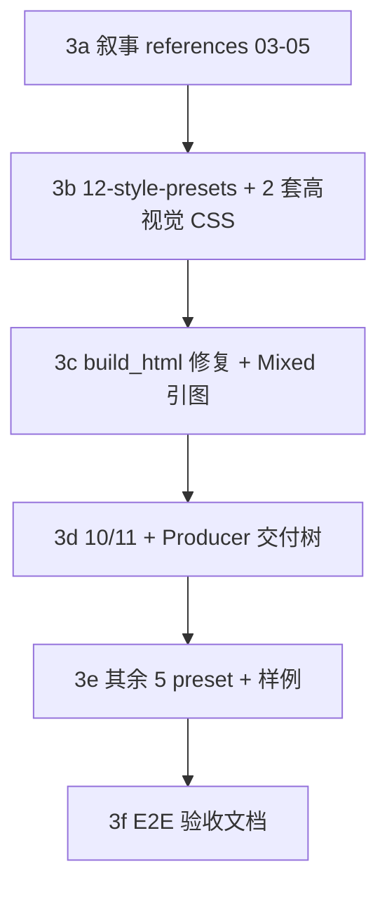

# Phase 3 实施 Brief v1

> **读者**：Phase 3 执行者、产品验收者、在 Agent 中调试 `ai-slide-producer` 的协作者。  
> **目标**：让九步管线在 Agent 里稳定跑完，并让交付物在内容、视觉、双输出上达到 PRD v1.0 承诺，而不只是 `teaching-clean` 工程 demo。

---

## 1. 一句话定位

Phase 1/2 证明：机器能产文件。  
Phase 3 要证明：这个 Skill 像产品一样能备课、能看、能选风格、能 Image / HTML / Mixed 交付。

---

## 2. 产品决策

| 决策 | 结论 | 原因 |
|------|------|------|
| 对外默认视觉 | `editorial-magazine` | 比 `teaching-clean` 更接近 guizang 的展示档，适合训练营与对外演示 |
| 工程回归视觉 | `teaching-clean` | 保留稳定、低变量、便于脚本回归 |
| 第二高视觉档 | `swiss-system` | 适合结构化、理性、信息密集场景 |
| guizang 视觉路线 | 先升级 CSS + layout 表现 | 不在 Phase 3 第一轮迁移完整 template，避免扩大范围 |
| 训练营主路径 | HTML-first + Mixed | HTML 保证中文正文稳定；封面、章节页、金句页用 Image 增强传播性 |
| PPTX 导出 | Backlog | PRD v1 不强制，实施总纲也标为可选 |

---

## 3. Phase 3 要解决的 6 类问题

### 3.1 叙事层独立成角色

现状：`03-strategist` / `04-researcher` / `05-writer` 缺失，Strategist / Researcher / Writer 职责挤在 `01` / `02`。

目标：

- Step 3 Outline 有独立 Strategist reference。
- Step 4 Slide Plan 有独立 Researcher / Writer 输入规范。
- Step 5 Reviewer 的返工路径能回到 Writer，而不是让 Agent 手写 HTML。

交付：

- `references/03-strategist.md`
- `references/04-researcher.md`
- `references/05-writer.md`
- `SKILL.md` Step 3-5 指向这些 reference。

### 3.2 视觉从工程 demo 升级到产品展示

现状：只有 `teaching-clean.css` + `teaching-clean.json`。

目标：

- PRD §10.4 的 7 套 preset 齐。
- 至少 `editorial-magazine` 与 `swiss-system` 浏览器效果明显优于当前 teaching-clean demo。
- `references/12-style-presets.md` 写清每套 preset 借鉴谁、何时选、HTML / Image 分别如何执行。

交付：

- `references/12-style-presets.md`
- `assets/style-presets/*.json`
- `assets/styles/*.css`
- `build_html.py` 按 `style_lock.style_name` 加载对应 CSS。

### 3.3 双输出产品化

现状：`generate_images.py` 与 `build_html.py` 分别可用，但 Image / HTML 没有形成 Mixed 产品路径。

目标：

- Mixed：HTML 正确引用 `images/slide-NN.png`。
- Image-first 默认路径与 html-takeover 决策树在 `11-producer.md` 固化。
- 教学场景默认 HTML-first + Mixed，封面、章节页、金句页可设 `image_requirement.needed = true`。

交付：

- 扩展 `08-web-renderer.md` 的 Mixed 规则。
- 更新 `build_html.py` image block 行为。
- 增加 `assets/examples/` 下 mixed 或 image-first 小样例。
- 更新 `15-export-contract.md` Mixed 树验收。

### 3.4 质量门禁与交付收口

现状：`14-quality-checklist.md` 有基础 QA，`10-style-guard.md` / `11-producer.md` 缺失。

目标：

- Style Guard 负责视觉守门：颜色、字体、layout、文本溢出、图片缺失、manifest 状态。
- Producer 负责交付组装：输出目录、README、可见产物、Output Mode 决策。
- Agent 不再自由发挥 `qa_report.md`。

交付：

- `references/10-style-guard.md`
- `references/11-producer.md`
- 可选轻量脚本或 checklist 扩展。

### 3.5 HTML 渲染从能跑到好看完整

现状：10 个 snippet 可渲染，但部分 layout 映射偏简化，视觉只在 `teaching-clean` 下回归过。

目标：

- 修复 comparison / timeline / framework 等多项内容映射。
- 高视觉 preset 下复测 gallery。
- `SKILL.md` / `08-web-renderer.md` 写死：最终 HTML 必须由 `scripts/build_html.py` 生成，禁止 Agent 手写 `index.html`。

交付：

- `build_html.py` 映射修复。
- gallery 在 `editorial-magazine` / `swiss-system` 下至少跑通 `validate_html.py`。

### 3.6 文档与 v1 验收

现状：实施总纲 Phase 3 只有 5 条 checkbox；UAT 表偏 Phase 2b。

目标：

- README 阶段表反映 Phase 3 开工与默认视觉策略。
- UAT 增加完整九步 E2E、视觉档次、Mixed 检查项。
- `references/00-15` 无 Phase 3 缺口。

交付：

- 本文档。
- `docs/skill-uat-checklist_v1.md` Phase 3 扩展。
- `README.md` / `docs/README.md` 更新。

---

## 4. 实施顺序



| 刀次 | 状态 | 内容 | 解决的问题 |
|------|------|------|------------|
| 3a | ✅ 完成 | `03/04/05` + `SKILL.md` Step 3-5 | Agent 乱写、跳步、叙事质量不可预期 |
| 3b | ✅ 完成 | `12-style-presets` + `editorial-magazine` + `swiss-system` | demo 丑、不像 guizang |
| 3c | ✅ 完成 | `build_html.py` 内容映射 + Mixed `` | 内容裁切、图文未合流 |
| 3d | ✅ 完成 | `10-style-guard` + `11-producer` + 强制 build discipline | 交付随意、无守门 |
| 3e | ✅ 完成 | 其余 preset CSS/JSON + image-first 样例 | PRD 7 套齐 |
| 3f | ✅ 完成 | README + UAT E2E | 可宣布 v1 |

**执行细则（给 CC）**：[`phase3c-3d-executor-brief_v1.md`](phase3c-3d-executor-brief_v1.md) · [`phase3e-3f-executor-brief_v1.md`](phase3e-3f-executor-brief_v1.md)

---

## 5. 明确不在 Phase 3 主路径

- laogouapi 异步 Jobs 轮询。
- `merge-to-pptx.ts`。
- 17 套 baoyu preset 全量迁移。
- 完整迁移 guizang template 结构。
- **Google nanobanana 生图 backend**（v1.0 完成后再接，见 [`phase3e-3f-executor-brief_v1.md`](phase3e-3f-executor-brief_v1.md) §8）。

---

## 6. 产品级验收标准

满足以下条件，才可称 PRD v1.0 Skill 闭环：

1. **Agent E2E**：新主题进入 Skill 后，可按 Gate 1-4 产出 `slide_plan.json` + `style_lock.json`，再由脚本生成 HTML / Image Prompts / 可选图片，最后给出 `qa_report.md` 与项目 README。
2. **禁止手写 HTML**：`index.html` 必须由 `scripts/build_html.py` 生成；Agent 不得绕过 renderer 手写整页 HTML。
3. **视觉**：至少 `editorial-magazine` 与 `swiss-system` 在浏览器里主观明显优于当前 `teaching-clean` demo。
4. **Mixed**：样例 `index.html` 中指定页显示 `images/slide-*.png`。
5. **References 完整**：`references/00-15` 不再有 `Phase 3` 缺口。
6. **回归**：gallery 10 页 + 新 preset 至少跑通 `validate_html.py`；有 key 时 image 冒烟 1 页。

---

## 7. 推荐验收命令

在 `skills/ai-slide-producer/` 下运行：

```bash
python3 scripts/validate_slide_plan.py assets/examples/teaching-clean-demo/source/slide_plan.json
python3 scripts/validate_context_lock.py assets/examples/teaching-clean-demo/source/style_lock.json
python3 scripts/build_html.py assets/examples/teaching-clean-demo
python3 scripts/validate_html.py assets/examples/teaching-clean-demo/index.html

python3 scripts/export_images_manifest.py assets/examples/teaching-clean-demo --include-all --backend none
python3 scripts/validate_images_manifest.py assets/examples/teaching-clean-demo
```

PRD v1.0 增补样例：

```bash
python3 scripts/build_html.py assets/examples/teaching-clean-layout-gallery
python3 scripts/validate_html.py assets/examples/teaching-clean-layout-gallery/index.html

python3 scripts/build_html.py assets/examples/editorial-magazine-demo
python3 scripts/validate_html.py assets/examples/editorial-magazine-demo/index.html

python3 scripts/build_html.py assets/examples/editorial-magazine-mixed-demo
python3 scripts/validate_html.py assets/examples/editorial-magazine-mixed-demo/index.html

python3 scripts/validate_slide_plan.py assets/examples/editorial-magazine-image-first-demo/source/slide_plan.json
python3 scripts/validate_context_lock.py assets/examples/editorial-magazine-image-first-demo/source/style_lock.json
python3 scripts/validate_images_manifest.py assets/examples/editorial-magazine-image-first-demo
python3 scripts/build_html.py assets/examples/editorial-magazine-image-first-demo
python3 scripts/validate_html.py assets/examples/editorial-magazine-image-first-demo/index.html

python3 scripts/validate_slide_plan.py assets/examples/swiss-system-demo/source/slide_plan.json
python3 scripts/validate_context_lock.py assets/examples/swiss-system-demo/source/style_lock.json
python3 scripts/build_html.py assets/examples/swiss-system-demo
python3 scripts/validate_html.py assets/examples/swiss-system-demo/index.html
```

## 8. v1.0 完成声明

- [x] 3a–3d：九步管线叙事层、Mixed、Style Guard / Producer 已完成。
- [x] 3e：7 套 preset CSS / JSON 齐，`editorial-magazine-image-first-demo` 与 `swiss-system-demo` 已落盘。
- [x] 3f：README、SKILL、UAT 勾选表与母 brief 已收口到 PRD v1.0。
- [x] Backlog 明确保持在 v1.0 之后：Google nanobanana backend、laogouapi 异步 Jobs、PPTX、17 套 baoyu preset 全量迁移。
