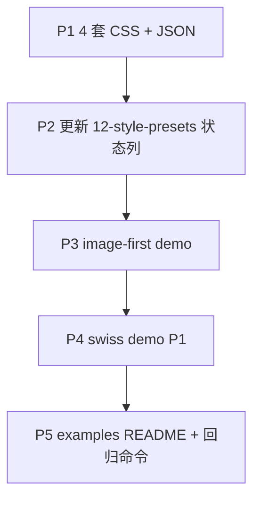

# Phase 3e / 3f 执行 Brief（给 CC）— 收口 PRD v1.0

| 字段 | 值 |
|------|-----|
| 版本 | v1.0 |
| 读者 | Phase 3 执行者（CC）、产品验收者（Peng） |
| 前置 | 3a–3d 已提交（`9b99c29` → `783b5df`） |
| 母文档 | [`phase3-implementation-brief_v1.md`](phase3-implementation-brief_v1.md) |
| 工作目录 | `skills/ai-slide-producer/` |

---

## 0. 目标与边界

**本阶段目标**：完成 Phase 3 剩余 **3e + 3f**，达到母 brief §6「PRD v1.0 Skill 闭环」六条，可对外说 **ai-slide-producer v1.0**。

**明确不在本阶段**（产品方已拍板，勿提前做）：

| 项 | 说明 |
|----|------|
| **Google nanobanana 生图** | v1.0 全部完成后再接；见本文 §8 Backlog |
| laogouapi 异步 Jobs | 仍 backlog |
| `merge-to-pptx.ts` | 仍 backlog |
| 17 套 baoyu preset 全量 | 只要 PRD 7 套 |
| guizang 完整 template 迁移 | 仍 CSS + snippet |

---

## 0.1 前置文档（产品方已提交，CC 无需再做）

- 出图耗时预期：`09` / `01` / `05` / `11` / `SKILL` / `skill-uat-checklist`
- 本执行 brief 与母 brief 索引

CC **直接从 Phase 3e 第一节**开工；勿提交 `teaching-clean-demo/images/`、`ai-slide-producer.zip`、`.env`。

---

# Phase 3e — 7 套 Preset 齐 + image-first 样例

## 1. Done 的定义

| # | 验收项 |
|---|--------|
| E1 | `assets/styles/` + `assets/style-presets/` 共 **7 套** 齐全（见下表） |
| E2 | `12-style-presets.md` 映射表 HTML/Image 列全部 **已完成** |
| E3 | 新增 **`editorial-magazine-image-first-demo`**（或等价命名）演示 image-first 路径 |
| E4 | （P1）`swiss-system-demo` 3–4 页 **或** gallery 复制一份 `style_name: swiss-system` 仅改 lock 后 rebuild |
| E5 | 各 preset 至少 `build_html` + `validate_html` 有一条回归路径（demo 或 gallery 变体） |

### 7 套 Preset 落盘状态（开工时）

| Preset | CSS | JSON | 3e 动作 |
|--------|-----|------|---------|
| `teaching-clean` | ✅ | ✅ | 仅回归 |
| `editorial-magazine` | ✅ | ✅ | 已有 demo |
| `swiss-system` | ✅ | ✅ | **补 demo 或 gallery 变体（P1）** |
| `blueprint` | ❌ | ❌ | **新建** |
| `sketch-notes` | ❌ | ❌ | **新建** |
| `corporate` | ❌ | ❌ | **新建** |
| `creator-social` | ❌ | ❌ | **新建** |

借鉴来源见 `12-style-presets.md` 各 preset 小节与 `../../references/baoyu-skills/`（只读，勿改上游）。

### CSS 纪律（与 3b 相同）

- 适配现有 10 个 layout snippet，**不**迁 guizang 全页 template。
- 通过 `style_lock` 注入 `--asp-bg` 等核心变量；扩展用新变量名。
- 每套 CSS 应有明显人格区分（勿 7 套都像 teaching-clean 灰卡片）。

---

## 2. image-first 样例规格

**目录建议**：`assets/examples/editorial-magazine-image-first-demo/`

| 字段 | 值 |
|------|-----|
| `style_name` | `editorial-magazine`（与对外展示 preset 一致） |
| `Output Mode` | `image-first`（`context_pack.md`） |
| 页数 | **4–6 页** |
| `image_requirement.needed` | **多数页 true**（至少 4 页） |
| 图片文件 | **仓库内小占位 PNG**（与 mixed-demo 同策略，~4KB 级），保证无 API 也能 `validate_html` / 目视 Mixed 无关 |
| 可选 | README 注明：真出图需本机 `generate_images.py`，约 60–90 秒/页 |

**必须包含**：

```text
source/（brief, context_pack, outline, slide_plan, style_lock, review_report）
prompts/（与 manifest 一致，可用 export 生成）
images_manifest.json
images/slide-NN.png（占位或真图，至少 4 张）
qa_report.md
README.md（含耗时预期 + 如何 --only P01 试跑真 API）
```

**不要**依赖提交 1MB+ 真图；真图留在 `teaching-clean-demo/images/`（gitignore 外、不提交）。

**与 mixed-demo 区别**：

| | mixed-demo | image-first-demo |
|--|------------|------------------|
| 主交付 | HTML + 局部图 | **images/** 为主 |
| needed 页比例 | 少（2 页） | 多（≥4 页） |
| index.html | 必验嵌图 | 可选；若有则说明为备份 |

---

## 3. 3e 任务顺序



1. **P1**：`blueprint.css/json`、`sketch-notes`、`corporate`、`creator-social`（可 2 PR：先 corporate+blueprint，再 sketch+creator）。
2. **P2**：`12-style-presets.md` 表 + 各 preset 小节「HTML 状态」改已完成。
3. **P3**：image-first demo + `assets/examples/README.md` 新行 + 验收命令块。
4. **P4（P1）**：`swiss-system-demo` 或 `teaching-clean-layout-gallery` 的 `style_lock` 副本目录 `swiss-system-layout-gallery/`。
5. **回归**：teaching-clean gallery、editorial-demo、mixed-demo、新 image-first demo 全部 `build_html` + `validate_html`。

---

## 4. 3e 验收命令

```bash
cd skills/ai-slide-producer

# 工程回归（不变）
python3 scripts/build_html.py assets/examples/teaching-clean-layout-gallery
python3 scripts/validate_html.py assets/examples/teaching-clean-layout-gallery/index.html

# 3b/3c 样例
python3 scripts/build_html.py assets/examples/editorial-magazine-demo
python3 scripts/validate_html.py assets/examples/editorial-magazine-demo/index.html
python3 scripts/build_html.py assets/examples/editorial-magazine-mixed-demo
python3 scripts/validate_html.py assets/examples/editorial-magazine-mixed-demo/index.html

# 3e 新增
python3 scripts/validate_slide_plan.py assets/examples/editorial-magazine-image-first-demo/source/slide_plan.json
python3 scripts/validate_context_lock.py assets/examples/editorial-magazine-image-first-demo/source/style_lock.json
python3 scripts/build_html.py assets/examples/editorial-magazine-image-first-demo
python3 scripts/validate_html.py assets/examples/editorial-magazine-image-first-demo/index.html

# 可选：有 OPENAI key 时冒烟 1 页（不提交大图）
python3 scripts/generate_images.py assets/examples/editorial-magazine-image-first-demo --backend openai --only P01
```

---

## 5. 3e 建议 commit

```text
feat(phase3e): complete seven presets and image-first demo
```

或拆两 commit：`feat(phase3e): four preset styles` + `feat(phase3e): image-first example`。

---

# Phase 3f — v1.0 验收文档与「可宣布」

## 1. Done 的定义

| # | 验收项 |
|---|--------|
| F1 | `docs/skill-uat-checklist_v1.md` 增加 **Phase 3 / v1.0 闭环** 章节（九步 E2E + 视觉 + Mixed + image-first + 耗时预期） |
| F2 | `README.md` 阶段表：**Phase 3 完成 / v1.0**；快速入口齐全 |
| F3 | `SKILL.md`「当前阶段」→ **v1.0 已完成**，下一阶段指向 backlog（非 Phase 4 大功能） |
| F4 | `phase3-implementation-brief_v1.md` §4 / §6 勾选 3a–3f 完成状态 |
| F5 | （可选）上级 monorepo `ai_slide_producer_implementation_guide_v1.md` Phase 3 checkbox 同步——**仅当 Peng 要求**，本仓库不强制 |
| F6 | `references/00-15` 无 🚧 Phase 3 残留 |

## 2. UAT 建议新增块（写入 checklist）

**C — Phase 3 v1.0 闭环（Agent + 本机）**

| # | 项 |
|---|-----|
| C1 | 新主题走通 Gate 1→4，产出 `outline` + `slide_plan` + `style_lock`，无手写 `index.html` |
| C2 | `editorial-magazine` demo 浏览器档次优于 teaching-clean |
| C3 | mixed-demo P04/P07 嵌图可见 |
| C4 | image-first-demo：`prompts/` + manifest + ≥4 张 `images/slide-*.png`（占位可） |
| C5 | Round 1 或出图前出现 **60–90 秒/页** 耗时说明 |
| C6 | `qa_report.md` 含 Content / Visual / Delivery 三节 |

**D — 本机脚本抽检（Peng）**

| # | 项 |
|---|-----|
| D1 | `probe_image_backend.py` → openai available |
| D2 | `generate_images.py --only P01` 可选真跑（不提交大图） |

## 3. 3f 任务清单

1. 扩展 `skill-uat-checklist_v1.md`（上表）。
2. 更新 `README.md`、`docs/README.md`（索引 `phase3e-3f` brief）。
3. 更新 `SKILL.md` 当前阶段与 examples 说明。
4. 母 brief 文末增加 **v1.0 完成声明** 与 backlog 指针。
5. **不**改 `generate_images.py` 接新模型（nanobanana）。

## 4. 3f 建议 commit

```text
docs(phase3f): v1.0 uat checklist and phase 3 completion
```

---

## 6. v1.0 宣布检查清单（给 Peng）

全部打勾后可称 **v1.0**：

- [x] 3a–3d 已 push（或 Peng 确认 main 含 `783b5df`）
- [x] 耗时预期 docs 已提交（产品方）
- [x] 3e：7 preset 文件齐 + image-first demo
- [x] 3f：UAT 更新 + README/SKILL 阶段完成
- [ ] Agent E2E 至少跑过 1 次（CraftAgents 或 Cursor）
- [ ] 本机 `probe` + 可选 `generate_images --only P01` 仍可用

---

## 7. 提交纪律

**永不提交**：

- `ai-slide-producer.zip`
- `assets/examples/teaching-clean-demo/images/`（本地 API 真图）
- `.env`

**可提交**：占位 PNG（<10KB/张）、`index.html` 构建产物（与现有 examples 一致）。

---

## 8. Backlog — v1.0 之后（勿在本阶段实现）

### Google nanobanana 生图（Option）

| 字段 | 说明 |
|------|------|
| 时机 | **v1.0 全部完成并验收后** 单独立项 |
| 目标 | 在 `generate_images.py` / `probe_image_backend.py` 增加第三 backend（与 openai、gemini 并列） |
| 预期改动 | `.env.example` 新变量；`09-image-renderer.md`；probe 级联；manifest `backend` 枚举；UAT 一条 |
| 前置 | Google API 文档、模型 ID、鉴权方式、是否 OpenAI 兼容 endpoint 由 Peng 提供 |
| 命名 | 产品称 nanobanana；代码可用 `nanobanana` 或 `google-nanobanana` kebab |

CC 在 3e/3f 中**只需**在 `phase3-implementation-brief` 或 `README` backlog 列表加一行指针，**不写实现**。

### 其他 backlog（保持）

- 异步 Jobs 轮询
- PPTX `merge-to-pptx.ts`
- `swiss-system` 若 3e 未做 demo，可延后但建议在 v1.0 前完成 P1

---

**关联**：[`phase3c-3d-executor-brief_v1.md`](phase3c-3d-executor-brief_v1.md) · [`skill-uat-checklist_v1.md`](skill-uat-checklist_v1.md) · [`09-image-renderer.md`](../references/09-image-renderer.md) §生成耗时预期
