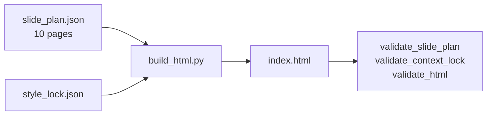

# 实施 PRD｜Teaching Clean Layout Gallery 回归样例

| 字段 | 值 |
|------|-----|
| 文档版本 | v1.0 |
| 状态 | 已完成（`8c17e62`，2026-05-21；实施记录 [`../assets/examples/teaching-clean-layout-gallery/WALKTHROUGH.md`](../assets/examples/teaching-clean-layout-gallery/WALKTHROUGH.md)） |
| 预计工时 | 0.5–1 天 |
| 任务类型 | 回归样例 + 文档（不开发新功能） |
| 依赖前提 | 仓库 `skills/ai-slide-producer/` 内 Phase 1 HTML 闭环已存在 |

---

## 0. 给实施者的一句话

在 **不修改** `build_html.py`、layout snippet、CSS 的前提下，新增目录 `assets/examples/teaching-clean-layout-gallery/`，用一份 **10 页** 的 `slide_plan.json` 让 PRD 规定的 **10 种 `layout_type` 各出现一次**，生成并 **提交** 可双击打开的 `index.html`，跑通全部验收命令。

**你不需要**阅读仓库根目录的主 PRD；**只需**读本文件 + 按路径打开仓库内已有脚本与 schema。

---

## 1. 为什么做（意义）

主项目 Phase 1 已证明：从 `slide_plan.json` + `style_lock.json` 可以构建本地可打开的 HTML。

现有样例 [`assets/examples/teaching-clean-demo/`](../assets/examples/teaching-clean-demo/) 只有 **4 页**，仅覆盖 4 种 layout（`cover` / `two-column` / `framework` / `closing`）。

另有 **10 个** layout 片段文件在 [`assets/templates/layouts/`](../assets/templates/layouts/)，但从未在同一份 deck 里全部渲染过。自动化脚本 `validate_slide_plan.py` 只检查「plan 里用到的 layout 对应文件是否存在」，**不保证**占位符能正确替换、CSS 是否撑得住版式。

本任务补齐 **layout 全量回归样例**：日后任何人改 snippet / CSS / `build_html.py` 占位映射，一条命令即可验证 10 种版式仍可用。



---

## 2. 背景（零项目上下文版）

### 2.1 AI Slide Producer 是什么

一个 **Cursor / Agent Skill**，把主题或资料变成 **单文件 HTML 横向翻页幻灯片**。

Phase 1 技术路径：

1. 人类或 Agent 编写 `source/slide_plan.json`（逐页结构与文案）。
2. 编写 `source/style_lock.json`（颜色、字体、风格名等，渲染时只读）。
3. 运行 Python 脚本 `scripts/build_html.py <项目目录>`，输出 `<项目目录>/index.html`。
4. 用 `validate_*.py` 做结构与 HTML 检查。

**本任务不涉及**图片生成 API、LLM 调用、新 preset、新脚本功能。

### 2.2 仓库与 Git 根目录

| 说明 | 路径 |
|------|------|
| **Git 仓库根** | `skills/`（不是整个 monorepo 根） |
| **Skill 工作根** | `skills/ai-slide-producer/` |
| 本 PRD 位置 | `skills/ai-slide-producer/docs/teaching-clean-layout-gallery-prd_v1.md` |

克隆后请先 `cd skills/ai-slide-producer`，下文所有相对路径均相对此目录。

### 2.3 已有参考样例

[`assets/examples/teaching-clean-demo/`](../assets/examples/teaching-clean-demo/)：

- 4 页叙事 demo，用于产品说明冒烟。
- **不要**改坏该目录；仅作 `source/` 文件格式参考。

---

## 3. 范围

### 3.1 In scope

| 交付项 | 路径 |
|--------|------|
| 新项目目录 | `assets/examples/teaching-clean-layout-gallery/` |
| 逐页计划 | `.../source/slide_plan.json`（10 页，附录 A 全文可复制） |
| 风格锁 | `.../source/style_lock.json`（复制 demo 后改 `deck_title`） |
| 极简中间产物 stub | `.../source/*.md`（brief / outline 等，各几行即可） |
| 生成物 | `.../index.html`（**必须提交到 git**） |
| 说明文档 | `assets/examples/README.md`（补充 gallery 说明与命令） |

### 3.2 Out of scope

- 修改 `scripts/build_html.py`、`assets/templates/**`、`assets/styles/**`（除非验收失败且需提 issue；不得为通过验收而私自改生产代码）
- 新增图片、`prompts/`、`images_manifest.json`
- Phase 2、CI、视觉精修、翻译

---

## 4. 路径与硬规则

### 4.1 关键路径表

| 概念 | 相对路径（自 `ai-slide-producer/`） |
|------|-------------------------------------|
| 参考 demo | `assets/examples/teaching-clean-demo/` |
| **本任务产出** | `assets/examples/teaching-clean-layout-gallery/` |
| slide plan schema | `schemas/slide_plan.schema.json` |
| style lock schema | `schemas/style_lock.schema.json` |
| 构建脚本 | `scripts/build_html.py` |
| 10 个 layout 片段 | `assets/templates/layouts/<layout_type>.html.snippet` |
| Web 渲染说明 | `references/08-web-renderer.md` |
| 命名与 build 策略 | `references/15-export-contract.md` |

### 4.2 slide_plan 硬规则

- `deck_meta.total_pages` **必须**等于 `10`
- `pages` 数组长度 **必须**为 `10`
- 第 *i* 个元素（从 1 起）的 `page_id` **必须**为 `P{i:02d}`（即 `P01` … `P10`）
- 10 种 `layout_type` **各出现 exactly 一次**，且与下表一致
- `deck_meta.style_name` 与 `style_lock.style_name` 均为 `teaching-clean`
- `deck_meta.output_mode` 建议 `html-only`
- 每种 `layout_type` 必须在 `assets/templates/layouts/` 存在同名 `*.html.snippet`

### 4.3 10 种 layout 与 build_html 占位符

`scripts/build_html.py` 根据 `on_slide_text.body` 生成不同 HTML 片段：

| layout_type | snippet 中关键占位符 | body 应如何写 |
|-------------|---------------------|---------------|
| `cover` | `page_title`, `key_message` | 可空 `body` |
| `section-divider` | `page_title`, `key_message` | 可空 `body` |
| `big-idea` | `key_message`, `sub_headline` | 可空 `body` |
| `two-column` | `body_items` | `body`: 字符串数组，每条一条 bullet |
| `quote` | `key_message`, `caption` | `key_message` 作引语正文 |
| `framework` | `tiles` | `body`: 3 条，格式 `标题:说明` 或 `标题：说明` |
| `timeline` | `steps` | `body`: 3–4 条，格式 `步骤名:说明` |
| `comparison` | `comparison_panels` | `body`: 2 条，格式 `Before:…` / `After:…`（或中文冒号） |
| `image-text` | `image_block`, `body_items` | `image_requirement.needed: false`；无图时应显示文字占位 |
| `closing` | `tiles` | `body`: 2–3 条短句 |

### 4.4 逐页规格表（实施对照）

| page_id | layout_type | page_role_in_story | page_title（示例） |
|---------|-------------|-------------------|-------------------|
| P01 | cover | cover | Layout Gallery · Cover |
| P02 | section-divider | section-divider | Section Divider |
| P03 | big-idea | core | Big Idea |
| P04 | two-column | context | Two Column |
| P05 | quote | quote | Quote |
| P06 | framework | framework | Framework |
| P07 | timeline | core | Timeline |
| P08 | comparison | comparison | Comparison |
| P09 | image-text | evidence | Image + Text |
| P10 | closing | takeaway | Closing |

---

## 5. 实施步骤（按序）

1. 进入目录：`cd skills/ai-slide-producer`（或你 clone 后的等价路径）。
2. 创建目录：`assets/examples/teaching-clean-layout-gallery/source/`。
3. 复制参考：  
   `cp -R assets/examples/teaching-clean-demo/source/* assets/examples/teaching-clean-layout-gallery/source/`
4. **覆盖** `source/slide_plan.json`：使用下文 **附录 A** 全文（不要手改漏字段）。
5. 编辑 `source/style_lock.json`：将 `deck_title` 改为 `Teaching Clean Layout Gallery`（其余字段保持与 demo 一致即可）。
6. （可选）将 `source/project_brief.md` 等 stub 标题改为 gallery 说明，避免与 demo 混淆。
7. 运行 **第 6 节** 全部验收命令；全部 exit 0。
8. 浏览器打开 `assets/examples/teaching-clean-layout-gallery/index.html`，完成 **第 6.2 节** 手工检查。
9. 提交 PR：**仅**包含  
   - `assets/examples/teaching-clean-layout-gallery/`  
   - `assets/examples/README.md`（若你更新了）  
   不要提交 `.env`、密钥、无关文件。

---

## 6. 验收标准

### 6.1 自动化（必须贴终端成功输出或 CI 日志）

在 `skills/ai-slide-producer/` 下执行：

```bash
python3 -m py_compile scripts/*.py

python3 scripts/validate_slide_plan.py \
  assets/examples/teaching-clean-layout-gallery/source/slide_plan.json

python3 scripts/validate_context_lock.py \
  assets/examples/teaching-clean-layout-gallery/source/style_lock.json

python3 scripts/build_html.py assets/examples/teaching-clean-layout-gallery

python3 scripts/validate_html.py \
  assets/examples/teaching-clean-layout-gallery/index.html
```

**期望：**

- 五条命令均 **exit code 0**
- `build_html.py` 打印 `wrote .../index.html`
- `validate_html.py` 打印 `html ok: ...`
- 生成的 HTML 中含 **10** 个 `<section class="slide" ... data-page-id="P01"` … `P10"`

### 6.2 手工（浏览器）

- 双击 `index.html`（`file://` 即可），控制台 **无 error**
- 右下角或控件可翻页；**共 10 页**
- 按 **ESC** 出现缩略图索引，列表 **10 项**
- 第 1 页 `data-layout="cover"`，第 10 页 `data-layout="closing"`
- 第 9 页 `image-text`：**没有** `images/slide-09.png` 时，应看到 **文字占位**（如 visual direction 文案），**不得**出现裂图图标
- 任意页不得出现未替换的 `{{something}}` 字面量

### 6.3 交付清单

- [ ] `teaching-clean-layout-gallery/source/slide_plan.json`
- [ ] `teaching-clean-layout-gallery/source/style_lock.json`
- [ ] `teaching-clean-layout-gallery/source/` 下 stub md（至少 `project_brief.md`）
- [ ] `teaching-clean-layout-gallery/index.html`（已生成并 **git 提交**）
- [ ] `assets/examples/README.md` 已说明 demo vs gallery
- [ ] 未引入 `.env`、API Key、与任务无关的代码改动

---

## 7. style_lock.json

从 demo 复制后 **只改** `deck_title`，推荐值：

```text
Teaching Clean Layout Gallery
```

其余字段建议保持与 [`teaching-clean-demo/source/style_lock.json`](../assets/examples/teaching-clean-demo/source/style_lock.json) 一致（`style_name`: `teaching-clean`，颜色、字体等）。

完整示例见 **附录 B**。

---

## 8. 故障排查

| 现象 | 处理 |
|------|------|
| `page_id should be P03, got ...` | `pages[]` 顺序与编号不一致；第 n 项必须是 `P{n:02d}` |
| `missing layout snippet` | `layout_type` 拼写错误；必须与文件名一致（如 `section-divider` 不是 `section_divider`） |
| `deck_meta.total_pages=10 but pages has N` | 数组长度不是 10 |
| 页面出现 `{{tiles}}` 等原文 | `build_html` 未替换 → **提 bug**，不要改 snippet 把占位符删掉 |
| framework / timeline / comparison 内容空白 | `body` 项须含 `:` 或 `：` 分隔标题与正文 |
| `style_name` mismatch | plan 与 lock 的 `style_name` 必须都是 `teaching-clean` |
| validate_html: residual placeholder | 重新跑 `build_html.py`；若仍失败，记录 issue |

---

## 9. 可选阅读（非必读）

1. [`references/08-web-renderer.md`](../references/08-web-renderer.md) — 10 种 layout 列表与运行方式  
2. [`references/15-export-contract.md`](../references/15-export-contract.md) — 文件命名、`build_html` 策略  
3. [`assets/examples/teaching-clean-demo/`](../assets/examples/teaching-clean-demo/) — 目录结构参考  

---

## 附录 A｜`slide_plan.json`（全文可复制）

将以下内容 **原样** 保存为  
`assets/examples/teaching-clean-layout-gallery/source/slide_plan.json`：

```json
{
  "deck_meta": {
    "deck_title": "Teaching Clean Layout Gallery",
    "audience": "Internal QA / layout regression",
    "total_pages": 10,
    "style_name": "teaching-clean",
    "narrative_arc": "Layout-Gallery-Only",
    "output_mode": "html-only",
    "canvas_ratio": "16:9",
    "language": "zh-CN",
    "created_at": "2026-05-21T12:00:00+08:00",
    "source_outline": "source/outline.md"
  },
  "pages": [
    {
      "page_id": "P01",
      "page_title": "Layout Gallery · Cover",
      "page_goal": "Verify cover layout renders",
      "page_role_in_story": "cover",
      "key_message": "Ten layout types in one deck for regression.",
      "on_slide_text": {
        "headline": "Teaching Clean Layout Gallery",
        "sub_headline": "Regression sample · cover",
        "body": [],
        "caption": "P01 / cover"
      },
      "speaker_notes": "Gallery page 1: cover.",
      "visual_direction": "clean hero opening",
      "layout_type": "cover",
      "image_requirement": {
        "needed": false,
        "intent": "none",
        "text_in_image_risk": "none"
      },
      "page_rhythm": "anchor"
    },
    {
      "page_id": "P02",
      "page_title": "Section Divider",
      "page_goal": "Verify section-divider layout",
      "page_role_in_story": "section-divider",
      "key_message": "This page tests the section divider template.",
      "on_slide_text": {
        "headline": "Section Divider",
        "body": [],
        "caption": "P02"
      },
      "speaker_notes": "Gallery page 2: section-divider.",
      "visual_direction": "chapter break",
      "layout_type": "section-divider",
      "image_requirement": {
        "needed": false,
        "intent": "none",
        "text_in_image_risk": "none"
      },
      "page_rhythm": "breathing"
    },
    {
      "page_id": "P03",
      "page_title": "Big Idea",
      "page_goal": "Verify big-idea layout",
      "page_role_in_story": "core",
      "key_message": "One sentence should dominate the canvas.",
      "on_slide_text": {
        "headline": "Big Idea",
        "sub_headline": "Supporting line under the statement",
        "body": [],
        "caption": "P03"
      },
      "speaker_notes": "Gallery page 3: big-idea.",
      "visual_direction": "large statement typography",
      "layout_type": "big-idea",
      "image_requirement": {
        "needed": false,
        "intent": "none",
        "text_in_image_risk": "none"
      },
      "page_rhythm": "anchor"
    },
    {
      "page_id": "P04",
      "page_title": "Two Column",
      "page_goal": "Verify two-column + body_items",
      "page_role_in_story": "context",
      "key_message": "Left narrative, right bullet list.",
      "on_slide_text": {
        "headline": "Two Column",
        "body": [
          "First bullet for body_items",
          "Second bullet with short copy",
          "Third bullet to test list spacing"
        ],
        "caption": "P04 / two-column"
      },
      "speaker_notes": "Gallery page 4: two-column.",
      "visual_direction": "split text columns",
      "layout_type": "two-column",
      "image_requirement": {
        "needed": false,
        "intent": "none",
        "text_in_image_risk": "none"
      },
      "page_rhythm": "dense"
    },
    {
      "page_id": "P05",
      "page_title": "Quote",
      "page_goal": "Verify quote layout",
      "page_role_in_story": "quote",
      "key_message": "Regression decks still need a strong pull quote.",
      "on_slide_text": {
        "headline": "Quote",
        "body": [],
        "caption": "Attribution · Layout Gallery"
      },
      "speaker_notes": "Gallery page 5: quote.",
      "visual_direction": "centered quote block",
      "layout_type": "quote",
      "image_requirement": {
        "needed": false,
        "intent": "none",
        "text_in_image_risk": "none"
      },
      "page_rhythm": "breathing"
    },
    {
      "page_id": "P06",
      "page_title": "Framework",
      "page_goal": "Verify framework tiles",
      "page_role_in_story": "framework",
      "key_message": "Three tiles driven by colon-separated body lines.",
      "on_slide_text": {
        "headline": "Framework",
        "body": [
          "Intake: clarify goals and output mode",
          "Plan: outline and slide plan",
          "Render: HTML or image paths"
        ],
        "caption": "P06 / framework"
      },
      "speaker_notes": "Gallery page 6: framework.",
      "visual_direction": "three educational tiles",
      "layout_type": "framework",
      "image_requirement": {
        "needed": false,
        "intent": "none",
        "text_in_image_risk": "none"
      },
      "page_rhythm": "dense"
    },
    {
      "page_id": "P07",
      "page_title": "Timeline",
      "page_goal": "Verify timeline steps",
      "page_role_in_story": "core",
      "key_message": "Steps list uses Title:Description lines.",
      "on_slide_text": {
        "headline": "Timeline",
        "body": [
          "Copy source: duplicate demo folder",
          "Paste plan: use appendix A JSON",
          "Validate: run scripts and open HTML"
        ],
        "caption": "P07 / timeline"
      },
      "speaker_notes": "Gallery page 7: timeline.",
      "visual_direction": "vertical or horizontal steps",
      "layout_type": "timeline",
      "image_requirement": {
        "needed": false,
        "intent": "none",
        "text_in_image_risk": "none"
      },
      "page_rhythm": "dense"
    },
    {
      "page_id": "P08",
      "page_title": "Comparison",
      "page_goal": "Verify comparison_panels",
      "page_role_in_story": "comparison",
      "key_message": "Before and after panels from two body lines.",
      "on_slide_text": {
        "headline": "Comparison",
        "body": [
          "Before: only four layouts tested in demo",
          "After: all ten layouts in one gallery deck"
        ],
        "caption": "P08 / comparison"
      },
      "speaker_notes": "Gallery page 8: comparison.",
      "visual_direction": "side by side panels",
      "layout_type": "comparison",
      "image_requirement": {
        "needed": false,
        "intent": "none",
        "text_in_image_risk": "none"
      },
      "page_rhythm": "dense"
    },
    {
      "page_id": "P09",
      "page_title": "Image + Text",
      "page_goal": "Verify image-text without image file",
      "page_role_in_story": "evidence",
      "key_message": "When no PNG exists, show text placeholder not broken img.",
      "on_slide_text": {
        "headline": "Image + Text",
        "body": [
          "No images/slide-09.png in this sample"
        ],
        "caption": "P09 / image-text placeholder"
      },
      "speaker_notes": "Gallery page 9: image-text, no raster file.",
      "visual_direction": "diagram placeholder on the left",
      "layout_type": "image-text",
      "image_requirement": {
        "needed": false,
        "intent": "diagram",
        "text_in_image_risk": "none",
        "generated_image_path": ""
      },
      "page_rhythm": "dense"
    },
    {
      "page_id": "P10",
      "page_title": "Closing",
      "page_goal": "Verify closing tiles",
      "page_role_in_story": "takeaway",
      "key_message": "Gallery complete when all checks pass.",
      "on_slide_text": {
        "headline": "Closing",
        "body": [
          "Run: validate_slide_plan + build_html + validate_html",
          "Open: index.html in browser",
          "Commit: gallery folder + examples README"
        ],
        "caption": "P10 / closing"
      },
      "speaker_notes": "Gallery page 10: closing.",
      "visual_direction": "three next-step tiles",
      "layout_type": "closing",
      "image_requirement": {
        "needed": false,
        "intent": "none",
        "text_in_image_risk": "none"
      },
      "page_rhythm": "anchor"
    }
  ]
}
```

---

## 附录 B｜`style_lock.json`（推荐全文）

```json
{
  "deck_title": "Teaching Clean Layout Gallery",
  "audience": "Internal QA / layout regression",
  "canvas_ratio": "16:9",
  "canvas_pixels": {
    "width": 1920,
    "height": 1080
  },
  "style_name": "teaching-clean",
  "primary_color": "#111827",
  "accent_color": "#2563EB",
  "background_color": "#F8FAFC",
  "text_primary_color": "#111827",
  "text_secondary_color": "#64748B",
  "border_color": "#D7DEE8",
  "font_heading": "Inter, \"Noto Sans SC\", sans-serif",
  "font_body": "Inter, \"Noto Sans SC\", sans-serif",
  "image_style": "clean educational diagram, simple geometric illustration, soft editorial screenshots",
  "density": "medium-low",
  "layout_bias": "grid",
  "forbidden": [
    "Do not claim one-click magic",
    "Do not overcrowd slides"
  ]
}
```

---

## 附录 C｜`project_brief.md` stub 示例

```markdown
# Project Brief

**Status**: confirmed

## Topic
Teaching Clean layout gallery regression

## Output Mode
- Final mode: html-only

## Note
This example exists only to exercise all 10 HTML layout snippets.
```

---

**文档结束** — 有疑问请先对照 `assets/examples/teaching-clean-demo/` 与验收命令输出，再联系任务发起人。
