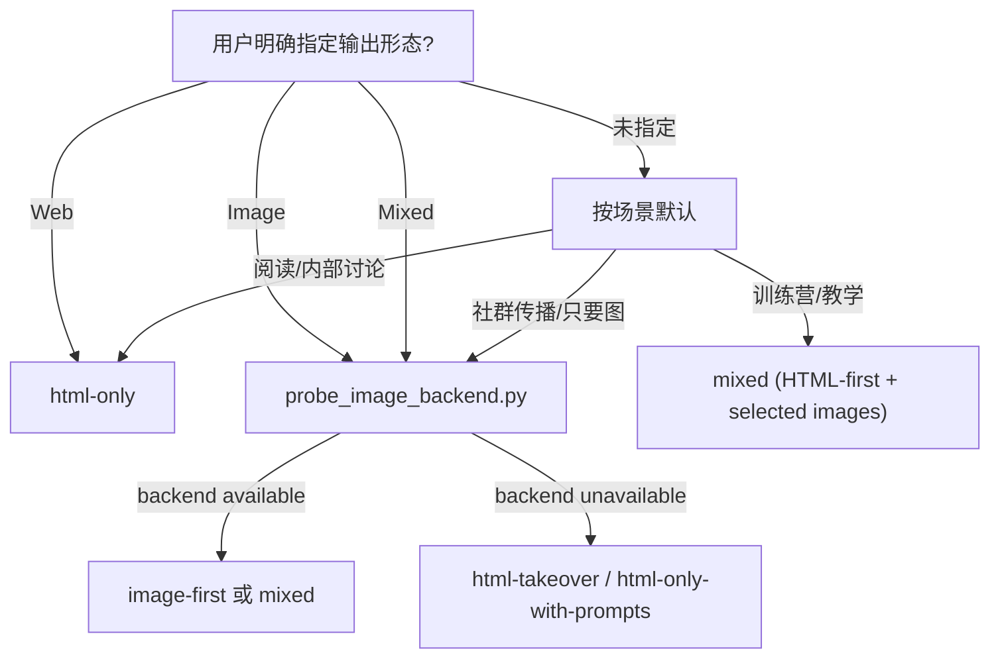

# 11 — Producer

> Step 9 交付组装文档。Producer 负责 Output Mode 决策落地、最终目录、项目 README、Gate 6 Result Visible。

---

## 角色

> 切换到 **Producer**。

职责：

- 读取 `context_pack.md` / `slide_plan.json` / `style_lock.json` / `qa_report.md`。
- 按 Output Mode 选择最终交付树。
- 写项目级 `README.md`。
- 确认用户至少能看到 HTML 或 Images。

不做：

- 不改 `slide_plan.json` 内容。
- 不改 `style_lock.json` 风格。
- 不手写最终 `index.html`。
- 不隐瞒 backend / manifest 的失败状态。

---

## Output Mode 决策树

Output Mode 在 Step 1/2 已写入 `project_brief.md` 和 `context_pack.md`；Producer 在 Step 9 只做复核。



探测脚本：

```bash
python3 scripts/probe_image_backend.py <project-dir>
```

CraftAgents 等环境排错见 `docs/plan-agent-backend-probe_v1.md`（维护者文档，非必读）。

优先级：

1. 用户显式 override。
2. `probe_image_backend.py` 结果。
3. 场景默认：训练营默认 `mixed`；纯阅读 / 内部讨论默认 `html-only`；社群传播默认 `image-first`。
4. backend 不可用时，Image 请求转 `html-takeover`，Mixed 请求转 `html-only-with-prompts`。

### 图片生成耗时（写入项目 README）

在交付含 `images/` 的项目时，README 须让用户对等待时间有预期（数据见 [`09-image-renderer.md`](09-image-renderer.md) §生成耗时预期）：

- 同步 backend 约 **60–90 秒/页**，`generate_images.py` **串行**处理；
- 续生命令：`python3 scripts/generate_images.py <project> --backend openai`（全量耗时会随页数线性增加）；
- 单页试跑：`--only P01`；已存在图默认跳过，强制重生成加 `--force`。

---

## 三种交付树

详见 [`15-export-contract.md`](15-export-contract.md)。Producer 只接受这三类：

| Output Mode | 必含 | 可选 / 条件项 | 缺文件处理 |
|-------------|------|---------------|------------|
| `mixed` | `index.html`, `images/`, `source/`, `qa_report.md`, `README.md` | `prompts/`, `images_manifest.json` | 图片缺失但 HTML 可读时标 warning；用户要求图片时阻塞 |
| `html-only` / `html-takeover` / `html-only-with-prompts` | `index.html`, `source/`, `qa_report.md`, `README.md` | `prompts/`, `images_manifest.json` | `index.html` 缺失即 fail |
| `image-first` / image-only | `images/`, `prompts/`, `images_manifest.json`, `source/`, `qa_report.md`, `README.md` | `index.html` | 图片缺失即 fail，除非用户同意 takeover |

---

## 项目 README.md 模板

```markdown
# <Deck Title>

<1 句话定位>

---

## 怎么看

- **HTML**：打开 `index.html`。键盘 ←→ 翻页，ESC 缩略图索引。
- **Images**：见 `images/`，按 `slide-NN.*` 顺序浏览。

## 这次交付包含

- Output Mode: <image-first | html-only | html-takeover | mixed | html-only-with-prompts>
- Style Preset: <style_name>
- HTML: <yes/no>
- Images: <N generated / N required>
- Prompts: <yes/no>
- QA: `qa_report.md`

## QA 摘要

- Content: <pass / pass-with-warnings / fail>
- Visual: <pass / pass-with-warnings / fail>
- Delivery: <pass / pass-with-warnings / fail>

## 怎么改

- 改文字：编辑 `source/slide_plan.json`，再运行 `python3 scripts/build_html.py <project>`。
- 改风格：回到 Gate 4 修改 `source/style_lock.json`，再重跑 HTML / Image。
- 局部重生：运行 `python3 scripts/regenerate_slide.py <project> PNN`。

## 图片生成要多久

- 同步 API 约 **60–90 秒/页**（视网关与模型而定）；脚本**按页串行**，不会一次请求出完全部页。
- 本 deck 需生成 **<N>** 张图时，请预留约 **<N×1–1.5> 分钟**（仅作估算）。
- 单页试跑：`python3 scripts/generate_images.py <project> --backend openai --only P01`

## 怎么续生图片

如果当前只有 prompts 没有图片：

1. 配置图片 backend（参考 `.env.example`）
2. 运行 `python3 scripts/generate_images.py <project> --backend openai`（见上，注意总耗时）
3. 再运行 `python3 scripts/build_html.py <project>`（Mixed 必须在图片就绪后）

## 已知问题

- <none / qa_report.md 中的 warning>
```

---

## Gate 6 Result Visible

交付前必须确认：

- `index.html` 存在且可打开，或
- `images/slide-01.*` 至少存在并可查看。

若两者都不存在，禁止向用户声明“交付完成”。

---

## 脚本关系

| 阶段 | 脚本 |
|------|------|
| Backend 探测 | `probe_image_backend.py` |
| 7A-P 准备 Prompt | `export_images_manifest.py` |
| 7A-G 出图 | `generate_images.py` |
| 7B HTML 构建 | `build_html.py` |
| HTML 校验 | `validate_html.py` |
| 局部重生 | `regenerate_slide.py` |
| Manifest 校验 | `validate_images_manifest.py` |

---

## 禁止项

- `index.html` 须由 Step 7B 产出（主路径=模型按 08 文档硬契约直接写；回退=`build_html.py`）；不在 7B 之外的步骤提前写 HTML。
- 禁止交付根目录混乱命名；必须按 `15-export-contract.md`。
- 禁止用外链图片替代本地 `images/slide-NN.*`。
- 禁止把 `needs-manual` / `pending` 的 manifest 状态说成成功。
